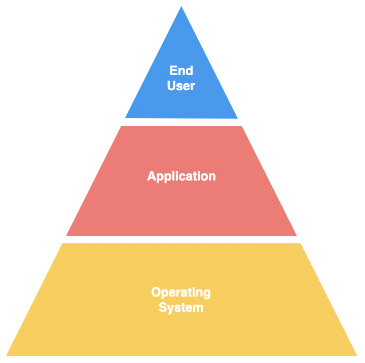
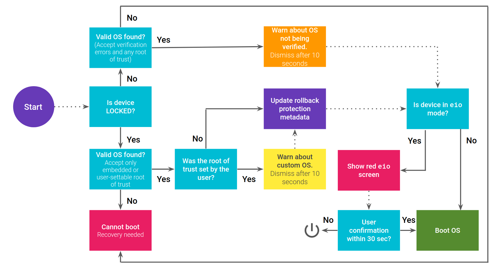

**Titre:** Modèle de sécurité technique d'Android

**Etudiant:** Simon Meier

**Professeur:** Marc Schaefer

---

# Introduction

Dans le cadre du cours "Sécurité", une présentation doit être réalisée sur un thème choisi parmi une liste. Le thème ici concerne modèle de sécurité d'Android.

Le modèle de sécurité *mobile* est apparu plus tard que le modèle de sécurité *desktop*. Avec l'expérience accumulée des failles du modèle précédent, ses développeurs ont apporté un soin particulier à son développement, qui se distingue par ses bases modernes, moins permissives et plus soucieuses de la sécurité.

Ce modèle se traduit notamment par un système de *permissions robuste*, une *chaîne de confiance*, des *mitigations modernes*, et *moins permissif* côté utilisateur, d'où la qualification de *"user-safe"*. [^2]

Ces termes sont le fil-rouge de ce document, qui décrit de quel manière le modèle de sécurité d'Android a été conçu et quels sont ses principales défauts et avantages.

# Android

Android est un système open-source (AOSP) développé par Google, qui implémente une politique stricte [**SELinux**](https://fr.wikipedia.org/wiki/SELinux) [^5]. En l'occurence, l'architecture de cette politique permet de classer les applications d'un système en différents groupes, avec des niveaux d'accès plus fins.

Android implémente d'autres mitigations telles que le verified boot [^1] et le CFI [^3]. Android utilise Linux comme son noyau, mais son *userspace* diffère radicalement des distributions GNU/Linux.

Android est une distribution de Linux avec un modèle de sécurité élaboré sur des bases modernes. L'ensemble des applications sont signées et contenues dans une sandbox avec des accès restreints par un modèle de permissions qui s'affine au fil des versions. [^6]

# Modèle de sécurité

Dans un souci de simplification, voici une représentation des acteurs du modèle de sécurité de façon tripartite:

1. **End**-**user**: l'utilisateur.
2. **Application**: le(s) software(s) utilisés
3. **OS**: le kernel et fonctionnalités de bases.


source [^8]

Le modèle de sécurité est basé sur le consentement de chacune des parties. Cela implique que pour qu'une action soit exécutée, les trois acteurs doivent être d'accord sur cette action.

L'utilisateur attend des deux autres parties d'avoir pris toutes les mesures nécessaires pour assurer sa sécurité. Il est logique de minimiser au maximum l'impact de l'utilisateur sur le mécanisme de sécurité.

En revanche, si l'action nécessite son consentement, c'est **lui** qui a le dernier mot. Le système dans son ensemble est alors vulnérable.

## Sécurity de l'OS

Le *kernel* est le logiciel central de l'OS. Il gère les ressources du processeur, la mémoire système, les périphériques système, ainsi que les systèmes de fichiers et la mise en réseau, et est responsable de la gestion de tous les processus.

Il sert de lien entre le logiciel et le matériel.

La sécurité du système d'exploitation d'*Android* repose sur les principales fonctionnalités de sécurité suivantes du noyau Linux :

- Isolation de processus.
- Modèle d'autorisation basé sur l'utilisateur.
- Communication inter-processus (IPC).

### Sandboxing

Android utilise le modèle d'autorisations Linux *user-based-permissions* pour isoler les ressources de l'application. Ce processus est nommé *sandboxing*.

L'objectif du *sandboxing* est d'empêcher les programmes externes malveillants d'interagir avec l'application:

- Les composants internes de l'OS sont protégés par le mécanisme de sandboxing.
- Les vulnérabilités exposées par une application ne peuvent pas être exploitées pour accéder au système externe.
- La communication sécurisée entre les applications est assurée par la protection Linux *user-based-permissions*.

Contrairement aux systèmes d'exploitation traditionnels, par ex. MacOS et Windows, Android utilise le concept d'ID utilisateur (UID) pour gérer le contrôle d'accès d'une application et non le contrôle d'accès de l'utilisateur du système.

Il est interdit à une application d'accéder aux données ou aux fonctionnalités du système d'une autre application sans les autorisations nécessaires.

L'application est en *sandboxing* au niveau du noyau, il est donc **garanti** que l'application est isolée du reste du système, quel que soit l'environnement de développement spécifique, les langages de programmation ou les API utilisés.

Par défaut, les applications ont un accès limité à l'OS. Cela garantit qu'une application malveillante ne peut pas accéder au système externe de l'intérieur.

Pour surmonter les limites du *sandboxing*, l'utilisateur peut *rooter* l'appareil. Cela implique le contrôle complet de l'appareil par l'utilisateur. La section suivante détaille ce concept.

### Rooting

Sur un système Linux, **root** est le nom du compte qui a accès à tous les fichiers et commandes. Étant basé sur Linux, Android a également ce concept.

Bien que contre-intuitif, **le propriétaire de l'appareil n'est pas *root***. Cette décision de conception a été prise pour des raisons de sécurité.

Si le propriétaire était capable de faire quoi que ce soit dans le système, il serait plus facile pour les applications malveillantes de prendre le contrôle de l'ensemble du système en incitant l'utilisateur à lui accorder les mêmes autorisations.

Néanmoins, Android est conçu pour être ouvert. Par conséquent, l'utilisateur est autorisé à rooter le téléphone, c'est-à-dire à passer à l'utilisateur root.

Il faut savoir qu'après le *rooting*, seules les mesures de sécurité appliquées par le système d'exploitation sont présentes. Cela signifie l'ensemble du système est entre les mains de l'utilisateur, qu'il contrôle tout et qu'il dispose des systèmes de sécurité conçus.

### Android Verified Boot

**Android Verified Boot** s'efforce de s'assurer que tout le code exécuté provient d'une source fiable (généralement des OEM [^9] d'appareils), plutôt que d'un attaquant ou d'une version "corrompue" d'OS.

À l'instar de la technologie *Blockchain*,, il établit une **chaîne de confiance** complète, à partir d'une racine de confiance protégée par le matériel jusqu'au chargeur de démarrage, à la partition de démarrage et à d'autres partitions vérifiées, y compris les partitions système, fournisseur et éventuellement *OEM*.

Lors du démarrage de l'appareil, chaque étape vérifie l'intégrité et l'authenticité de l'étape suivante avant de continuer l'exécution. Si l'un des composants de la chaîne est altéré, toute la chaîne est invalidée et l'utilisateur est averti.

Ce système est fondamental dans tout modèle de sécurité actuel. C'est sur lui que l'intégrité et l'authenticité du système et de la chaîne de démarrage sont assurés. La condition est que le bootloader demeure verrouillé. Il protège de toute forme d'altération par un attaquant physique ou non:

- Les attaques *evil maid*, autrement dit par possession physique.
- La persistance de *malwares*, de *rootkits*.
- Les attaques par *rollback*, qui consistent à retourner sur des versions antérieures du système pour exploiter une faille.

#### Android Verified Boot Flow

L'état de l'appareil peut être l'un des suivants:

- **LOCKED**: aucun logiciel personnalisé ne peut être flashé sur l'appareil et la vérification du démarrage est active.

- **UNLOCKED**: le logiciel personnalisé peut être flashé sur l'appareil et la vérification du démarrage est inactive.

 source [^7]

*Root of trust* est une clé cryptographique utilisée pour signer la copie Android qui s'exécute sur l'appareil. [^10]

Cette clé fait partie du *Verified Boot*. En tant qu'utilisateur, il est possible de remplacer cette clé afin d'exécuter des versions personnalisées d'Android.

Ainsi, il est possible de conserver le mécanisme de *Verified Boot* même si une version différente du système d'exploitation est utilisée.

Android fournit en permanence des mises à jour de sécurité mineures aux côtés des principales fournies avec chaque nouvelle version d'Android.

Les mises à jour mineures corrigent généralement les vulnérabilités découvertes.

### Faille possible

Un attaquant pourrait essayer de rétrograder la version d'Android exécutée sur l'appareil afin d'exploiter les vulnérabilités qui ont été corrigées. Cette classe d'attaques est atténuée par le système de *Rollback Protection*. *Rollback Protection* fait aussi partie du *Verified Boot*.

## Sécurité des applications

L'aspect sécurité d'une application est souvent négligé, ce qui amène une application à devenir un vecteur d'attaque, exploité par des acteurs malveillants.

Plusieurs mécanismes sont mis en place pour rendre le modèle de sécurité robuste à ce niveau:

1. Système de permissions.
2. Stockage des données.
3. Interprocess communication.
4. Signature de l'application et mitigations, authentificateurs.

### Système de permissions

Les applications Android nécessitent le consentement de l'utilisateur pour effectuer des actions qui pourraient avoir un impact sur d'autres applications, le système d'exploitation ou l'utilisateur lui-même.

Les autorisations requises par une application sont déclarées dans le fichier `AndroidManifest.xml`. Chaque autorisation est spécifiée dans sa propre balise uses-permission.

Certaines autorisations sont accordées à l'application par défaut lorsqu'elles sont spécifiées. Cependant, l'autre catégorie d'autorisations, appelées autorisations dangereuses, nécessite un consentement spécial de l'utilisateur.

Selon la version d'Android exécutée sur l'appareil, des autorisations dangereuses sont requises comme:

- **Autorisations au moment de l'installation** (pour Android 5.1.1 et versions antérieures):
  - lorsqu'une application est installée, l'utilisateur se voit présenter la liste de toutes les autorisations requises par l'application.
- **Autorisations d'exécution** (pour Android 6.0 et supérieur):
  - lorsqu'une application demande une autorisation, l'utilisateur est invité par une boîte de dialogue. Contrairement aux autorisations d'installation, les autorisations d'exécution sont généralement demandées lorsque la fonctionnalité respective est nécessaire. Par exemple, une autorisation de caméra doit être demandée avant que l'utilisateur n'essaie de prendre une capture.

### Stockage des données

Le stockage de données est le domaine le plus sensible de la sécurité d'*Android*. Dans la majorité des attaques, les données sont le but ultime d'un attaquant. Il est donc vital d'assurer que chaque option de stockage de données est correctement sécurisée en fonction de la sensibilité des données enregistrées.

Trois manière de stockées les données sont proposées:

1. **Stockage interne:**
   Les données stockées ici ne sont visibles que pour l'application correspondante. Les autres applications n'ont pas accès aux fichiers stockés dans le répertoire de l'application respective. Lorsque l'application est désinstallée, toutes les données stockées sont effacées.

2. **Stockage externe:**
   Les données stockées dans le stockage externe sont globalement lisibles et inscriptibles. Cela signifie que n'importe quelle application peut lire ou écrire les fichiers stockés ici. Par conséquent, il est nécessaire que les informations sensibles de l'application n'y soit pas stockées. Cependant, dans le cas où les informations peuvent être sauvegardées publiquement en toute sécurité, il est nécessaire d'effectuer les validations nécessaires lors de la relecture. Puisque les données peuvent être modifiées par d'autres applications ou attaquants, il n'est pas possible de savoir si les données écrites précédemment ne se sont pas transformées en un logiciel malveillant chargé dynamiquement.

2. **Fournisseurs de contenu:**
   Ils fournissent une abstraction des données stockées. Avec l'utilisation de fournisseurs de contenu, le contrôle sur les autorisations de lecture et d'écriture est élargi. Si plusieurs applications sont sous la même signature, il est possible de partager des données entre elles avec l'utilisation d'un fournisseur de contenu, afin que les données ne soient visibles qu'entre ces applications.

L'introduction de *Scoped Storage*, dans Android 10, a éliminé la plupart des risques associés au stockage externe.

> With Android 10, we adjusted how storage permission works, to give apps the access they need. This also limits file clutter by encouraging apps to save files in their designated directories which are cleared when an app is deleted. [^11]

Dans le cas où il est nécessaire de stocker de manière persistante des paires *key-values*, nous pouvons utiliser l'API `SharedPreferences` fournie par Android.

Il est courant chez les développeurs de stocker les informations d'identification de l'utilisateur dans `SharedPreferences`.

Cependant, tout ce qui est stocké peut éventuellement se retrouver entre les mains d'un attaquant.

C'est pourquoi l'ajout d'une couche de sécurité supplémentaire est nécessaire par le cryptage des données stockées.

Pour chiffrer les données, Android fournit la bibliothèque `Security` qui comprend, entre autres, deux classes pour le chiffrement des données:

- `EncryptedFile`:
  - Fournit une implémentation personnalisée sur `FileInputStream` et `FileOutputStream`, créant efficacement des flux de données plus sécurisés:
    - les données sont chiffrées et déchiffrées à chaque opération d'E/S
- `EncryptedSharedPreferences`:
  - Fournit une couche sécurisée sur `SharedPreferences`. Crypte automatiquement les clés et les valeurs à l'aide d'une méthode à deux schémas (cryptage symétrique).

### Interprocess communication

Les mécanismes *IPC* permettent d'appliquer des politiques de sécurité basées sur la relation entre un processus source et un processus cible. Android fournit les classes suivantes qui facilitent la communication interprocessus :

- Intent.
- Binder.
- Messenger.

Les mécanismes susmentionnés fonctionnent généralement en conjugaison avec des `services` et des `broadcast receivers`.

Les `Intent` sont le mécanisme incontournable pour transmettre des données lors du développement d'applications avec plusieurs activités et services. Les `Intent` peuvent être **explicites** ou **implicites**.

Les `Intent` **explicites** sont conçues pour être reçues par un composant **explicite**, d'où son nom.

De cette façon, il est possible de certifier que les données envoyées par l'*application A* ne sont reçues que par l'*application B*. De plus, des `Intent` **explicites** peuvent être utilisées pour envoyer des données entre les activités à l'intérieur des applications.

En revanche, les `Intent` **implicites** spécifient une action qui doit être effectuée. Selon l'action, l'`Intent` peut inclure certaines données nécessaires à l'action.
Les `Intent` **implicites** sont généralement utilisées lorsque l'application ne peut pas effectuer une action et qu'il est nécessaire de déléguer la tâche à une application tierce.

#### Exemple

Pour envoyer un message d'une application à une autre, une intention avec l'action `ACTION_SEND` doit être utilisée.

Toute application qui déclare un `intent-filter` sur l'action `ACTION_SEND` peut **intercepter** l'`Intent` **implicite**. Lorsque plusieurs applications peuvent répondre à un`Intent` **implicite**, un sélecteur s'affiche. Dans le cas où une seule application peut y répondre, elle est sélectionnée implicitement et aucun sélecteur n'est affiché.

Un risque de sécurité est soulevé lorsqu'un`Intent` **implicite** implique de se lier à un service. L'utilisation d'une `Intent` **implicite** peut permettre à un service malveillant de répondre à la requête, en interceptant efficacement toutes les communications.

À partir d'Android 5.0, une exception est levée si l'intention transmise à la méthode `bindService` est un `Intent` **implicite**.

`Binder` et `Messenger` sont utilisés pour implémenter l'appel de procédure à distance (RPC) IPC dans Android. Ils fournissent une interface qui facilite la communication sécurisée entre une application et un service.

### Signature de l'application

La signature de code offre aux développeurs la possibilité d'identifier l'auteur d'une application et de la mettre à jour de manière transparente. Par exemple, les applications qui ne sont pas signées par un développeur ne peuvent pas être téléchargées sur *Google Play*. [^12]

Si un package d'application non signé s'est retrouvé sur l'appareil, l'application ne peut pas être installée car le gestionnaire de packages vérifie si le package est signé ou non avant d'installer une application.

La signature d'application est la première étape du mécanisme de *sandboxing* d'application.

Un UID est attribué en fonction du certificat utilisé pour signer l'application.

Si plusieurs applications sont signées à l'aide du même certificat, elles peuvent spécifier la clé `android:sharedUserId` dans leur manifeste afin qu'elles partagent le même **UID**.

Néanmoins, la clé a été *dépréciée* dans l'**API 29** car elle pouvait entraîner un comportement non déterministe lors de *l'attribution de l'UID*. Son utilisation est donc fortement déconseillée et peut être supprimée dans les futures versions.

Les applications ont la possibilité de créer des autorisations de sécurité *protégées par la signature*. De cette façon, les applications signées **sous le même certificat**, mais *sous différents UID et bacs à sable applicatifs*, peuvent accéder à des fonctionnalités restreintes exposées par l'une ou l'autre.

## Exemple d'attaque célèbre

#### HummingBad (2016)

Créé par la société de publicité chinoise Yingmob, *HummingBad* [^4] a généré des revenus pour la société susmentionnée en cliquant automatiquement sur des publicités intrusives.

Cinq mois après sa première découverte, en juillet 2016, une société multinationale de sécurité informatique, appelée *Check Point*, a publié un rapport contenant des données sur le malware *HummingBad*.

Non seulement *HummingBad* a affiché des publicités et simulé des clics dessus, mais il a également installé des **applications frauduleuses** sur l'appareil infecté.

Le service responsable des réseaux publicitaires utilisés par les applications s'appelle **Se**. Un récepteur de diffusion est enregistré lorsque le logiciel malveillant est installé. Ce récepteur de diffusion écoute alors les événements suivants :

- **USER PRESENT** — se déclenche lorsque l'appareil est déverrouillé

- **BOOT COMPLETED** - se déclenche une fois que l'utilisateur a terminé le démarrage

- **SCREEN ON** — se déclenche lorsque l'appareil se réveille et devient interactif

Lorsqu n'importe lequel des événements mentionnés précédemment est reçu par le récepteur de diffusion, le service **Se** démarre.

Voici une partie du code concerné pour illustrer le fonctionnement:

[**Receiver.java**](https://gist.github.com/deniskrr/7e1bcccde27ba81d17f074729aba5fb4#file-receiver-java)

```java=
public void onReceive(Context context, Intent intent) {
        Editor editor = UtilsClass.getInstance().getSharedPreferences(context).edit();
        if (Utilstools.ACTIONIAD.equals(intent.getAction())
                || Utilstools.ACTIONZDT.equals(intent.getAction()) ||
                "android.intent.action.USER_PRESENT".equals(intent.getAction()) ||
                "android.intent.action.BOOT_COMPLETED".equals(intent.getAction()) ||
                "android.intent.action.SCREEN_ON".equals(intent.getAction())) {
            if ("android.intent.action.BOOT_COMPLETED".equals(intent.getAction())) {
                MobclickAgent.onEvent(context, "SSP_ReCreate");
            }
            if (!Utilstools.getInstance().isServiceRunning(context)) {
                context.startService(new Intent(context, Se.class));
            }
        }
  //...
}
```

Lorsqu'une publicité est affichée, le processus capture l'événement *KeyDownEvent* et ne l'envoie pas plus loin si le *keycode* est l'un des suivants :

- KEYCODE HOME (3)

- KEYCODE BACK (4)

- KEYCODE MENU (82)

[**KeyCapture.java**](https://gist.github.com/deniskrr/76499ac07a0190a6f515944ae641d13f#file-keycapture-java)

```java=
public boolean onKeyDown(int keyCode, KeyEvent event) {
    if (keyCode == 4 || keyCode == 82 || keyCode == 3) {
        return false;
    }
    return super.onKeyDown(keyCode, event);
}
```

Sans pouvoir utiliser les commandes de navigation, l'utilisateur est **obligé** de traiter l'annonce.

Cependant, si l'utilisateur essaie de fermer la publicité, l'événement de clic est intercepté et un événement de clic au milieu de l'écran est envoyé à la place.

[**SimulateClick.java**](https://gist.github.com/deniskrr/40c99e4a7887a4c4d5856fe1466314a2#file-simulateclick-java)

```java=
public void setSimulateClick(final Activity activity) {
    activity.runOnUiThread(new Runnable() {
        public void run() {
            DisplayMetrics dm = activity.getResources().getDisplayMetrics();
            int x = dm.widthPixels / 2;
            int y = dm.heightPixels / 2;
            long downTime = SystemClock.uptimeMillis();
            MotionEvent downEvent = MotionEvent.obtain(downTime, downTime,
                    0, (float) x, (float) y, 0);
            MotionEvent upEvent = MotionEvent.obtain(downTime, downTime,
                    1, (float) x, (float) y, 0);
            activity.getWindow().getDecorView().dispatchTouchEvent(downEvent);
            activity.getWindow().getDecorView().dispatchTouchEvent(upEvent);
            downEvent.recycle();
            upEvent.recycle();
        }
    });
}
```

Dans un premier temps, *HummingBad* va tenter d’accéder à des droits **root** du téléphone en utilisant des failles.

S’il n’y parvient pas, il va alors lancer un deuxième processus d’attaque en émettant une fausse notification de mise à jour système.

En la validant l’utilisateur va alors lui donner des droits et des accès privilégiés à différents points du téléphone. Pour les deux vecteurs d’attaque, le résultat est le même, HummingBad va afficher des campagnes de publicité issues de *Yingmob* et télécharger des fichiers .apk. Le malware va même jusqu’à modifier le numéro IMEI du téléphone pour améliorer le nombre d’affichage de publicité et d’installation d’applications.

# Conclusion

Tout comme les ordinateurs, les smartphones sont des cibles privilégiées d'attaques. De plus en plus d'utilisateurs et d'entreprises utilisent régulièrement des smartphones comme outils de communication. Mais ils les utilisent aussi pour la planification, la gestion et l'organisation de leurs vies professionnelle et privée, ce qui est autrement plus confidentiel. C'est donc toujours et même de plus en plus un sujet actuel sur lequel les entreprises et les particuliers ont besoin de personnes pouvant répondre a leurs besoins de sécurité.

En effet, les smartphones collectent et compilent un nombre croissant d'informations sensibles dont l'accès doit être contrôlé afin de protéger la vie privée de l'usager ainsi que ce qui est du domaine de la propriété intellectuelle de l'entreprise. Android étant un système ouvert, c'est le candidat de choix pour être accueilli par l'écrasante majorité des smartphones qui fonctionnent actuellement. Malheureusement, cette forme de qualité est aussi sa faiblesse.

Les constructeurs (OEMs) modifient assez intensivement Android en y intégrant des services tiers, qui ne font que contribuer à agrandir la surface d'attaque et introduire des *bugs*. Ces OEMs vont même jusqu'à réduire la sécurité globale : Asus par exemple rend la politique SELinux plus permissive, ce qui va à contre sens du modèle de sécurité de base, et beaucoup de smartphones n'implémentent pas *android verified boot* correctement.  Malgré un modèle profondément pensé pour la sécurité, les constructeurs tiers l'affaiblissent considérablement. Le modèle de sécurité d'Android actuel souffre aussi de la fragmentation. En rendant le système modulaire, il persiste à travers les mises à jour.

En ce qui concerne le hardware, les modèles de smartphones Pixels obtiennent la meilleure note. Il y a peu de modifications à AOSP et toutes les sécurités sont bien implémentées. Aussi, le hardware est pensé pour tirer profit des dernières API disponibles sur Android (exemple avec StrongBox). Ils ont également un suivi convenable dans le temps et avec transparence : 3 ans en moyenne de mises à jour majeures avec patchs de sécurité livrés chaque début de mois, avec rapidité. De plus, ils intègrent un kernel Linux compilé par clang avec le Control Flow Integrity, ce qui n'est pas le cas de la majorité des modèles.

Modifier le système de base pour installer des éléments par du rooting est à éviter. Android se fonde sur le principe du moindre privilège et n'emploie pas lui-même des privilèges non-restreints. Aussi, les ROMs customs sont négligentes du modèle de sécurité; bootloader déverrouillé (car elles ne sont pas reconnues comme OS valide), patchs de sécurités partiellement implémentés pour le matériel, entre autres failles.

# Bibliographie

[1] Bruno Camus, Rapports de stages et mémoires, Les éditions d'organisation, 1989. (Bibliothèque ENSPS : 808.06 CAM)

[2] Règles typographiques en usage à l'Imprimerie nationale, Imprimerie nationale, troisième édition, 1994.

[3] [Eisvogel](https://github.com/Wandmalfarbe/pandoc-latex-template), Latex template, Copyright (c) 2017 - 2021, Pascal Wagler, 2014 - 2021, John MacFarlane, open source licensed under the BSD 3-Clause License.

[4] Check Point Software Technologies, ©2016, [From HummingBad to Worse](https://blog.checkpoint.com/wp-content/uploads/2016/07/HummingBad-Research-report_FINAL-62916.pdf)

[5] Wikipédia, Security-Enhanced Linux, [**SELinux**](https://fr.wikipedia.org/wiki/SELinux)

[6]: Wonderfall, [Modèle sécurité mobile](https://wonderfall.space/modele-securite-mobile/)

[7]: Android, [Verified Boot](https://source.android.com/security/verifiedboot)

[8]: Android, Scoped Storage, [Modern user storage on Android](https://medium.com/androiddevelopers/modern-user-storage-on-android-e9469e8624f9)

[9]: Wikipédia, [Signature numérique](https://fr.wikipedia.org/wiki/Signature_numérique)

[10] Android Central. Root Your Android Phone: What is Root & How To. [Root](https://www.androidcentral.com/root)

[^1]: Android, [Verified Boot](https://source.android.com/security/verifiedboot)

[^2]: Wonderfall, Modèle sécurité mobile, [Un peu d'histoire](https://wonderfall.space/modele-securite-mobile/)

[^3]: Wikipédia, Control Flow Integrity, [CFI](https://en.wikipedia.org/wiki/Control-flow_integrity)

[^4]: Check Point Software Technologies, ©2016, [From HummingBad to Worse](https://blog.checkpoint.com/wp-content/uploads/2016/07/HummingBad-Research-report_FINAL-62916.pdf)

[^5]: Wikipédia, Security-Enhanced Linux, [**SELinux**](https://fr.wikipedia.org/wiki/SELinux)

[^6]: RENÉ MAYRHOFER, Google and Johannes Kepler University Linz & co., [The Android platform Security Model](https://arxiv.org/pdf/1904.05572.pdf)

[^7]: Page 26, Figure 2, RENÉ MAYRHOFER, Google and Johannes Kepler University Linz & co., [The Android platform Security Model](https://arxiv.org/pdf/1904.05572.pdf)

[^8]: The layers of the android security model [Pro Android dev](https://proandroiddev.com/the-layers-of-the-android-security-model-90f471015ae6)

[^9]: Acronyme: original equipment manufacturer

[^10]: Wikipédia, [Root of trust](https://source.android.com/security/verifiedboot/device-state#:~:text=Root%20of%20trust%20is%20the,of%20Android%20intended%20for%20distribution.)

[^11]: Scoped Storage, [Modern user storage on Android](https://medium.com/androiddevelopers/modern-user-storage-on-android-e9469e8624f9)

[^12]: Wikipédia, [Signature numérique](https://fr.wikipedia.org/wiki/Signature_numérique)
