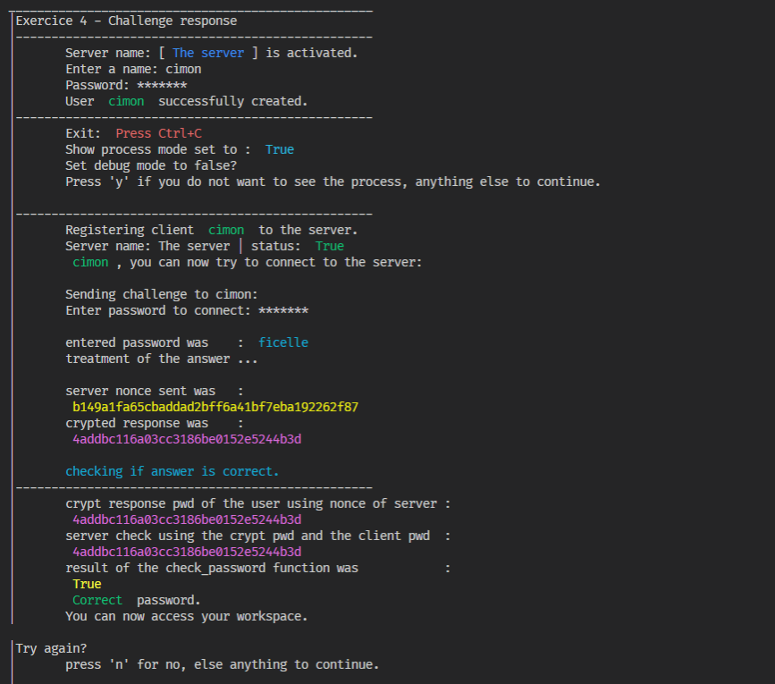

**Titre:** Exercice à rendre: challenge-response

**Etudiant:** Simon Meier

**Professeur:** Marc Schaefer

---

## Consigne

> Voir <https://en.wikipedia.org/wiki/Challenge%E2%80%93response_authentication>
> Tenir compte des recommandations [hash, crypto, PRNG](02_Authentification/autres/nma-hash-crypt-PRNG-recommandations.pdf).
> PS: nous avons déjà vu un tel protocole challenge-response dans le CHAP des slides ainsi que pour l'authentification d'un téléphone IP à Asterisk en R+A 2e année.

**Délai: fin de la semaine des présentations.**

### Arborescence du projet

```python=
exercice4
|   readme.md
|   requirements.txt
|---.venv
|---__pycach__
|---images
|---backgrounds
|---challenge_response_authentication
       client.py
       cryptool.py
       main.py
       server.py
```

### 4. Exercice à rendre: challenge-response

Dans le langage de votre choix et par groupe de deux, implémentez un client et un serveur d'authentification basé sur un challenge-response.

Indications (répondre aux questions en commentaire dans le code)

### Questions

* quel hachage cryptographique utilisez-vous et pourquoi?
  * J'utilise MD5(pour Message Digest 5). C'est une fonction de hachage cryptographique qui permet d'obtenir l'empreinte numérique d'une variable, par exemple une chaîne de caractère. Il est aujourd'hui dépassé et absolument impropre à toute utilisation en cryptographie ou en sécurité. Le seul intérêt ici est qu'il convient bien à l'exercice d'implémentation du challenge-response protocole.
* quelles précautions pour le générateur aléatoire?
  * utilisation du module 'secrets' et de la fonction `tocken_hex()` pour générer une chaîne de caractère aléatoire. La différence comparé au module random de base est que le module random ne fournit pas des nombres suffisamment aléatoire, comme elle suit une distribution uniforme et que si elle est basée sur le temps, elle est assez facile à prédire.  Une attaque en brute force est alors suffisante aujourd'hui pour mettre en péril ce genre de génération aléatoire. C'est pourquoi il est nécessaire d'utiliser des fonctions plus élaborées, qui prennent en paramètre des sources de l'OS pour produire des nombres aléatoires. En revanche, l'on pourrait imaginer aujourd'hui des systèmes de réseaux de neurones qui apprendraient les valeurs de ces sources par catégories d'OS et ainsi prédire la distribution de ces valeurs. Tout système à ces limites, malgré tout c'est toujours mieux que d'utiliser le module random de base.
* quelles précautions pour la construction garantissant l'unicité du nonce?
  * il ne doit pas se répéter; ici, une boucle vérifie si le nonce existe déjà dans une liste. Cette opération est faite lors de l'utilisation de la fonction `createNonce()`.
* quelles précautions pour la durée de validité du nonce?
  * le nonce est unique et généré à chaque fois que le challenge est envoyé.
* la partie réseau n'est pas nécessaire: des appels de fonctions simples sont autorisés.

## Utilisation du programme

1. Activez le `.venv` que vous avez configurer avec le 1er `readme` du projet:

    ```python=
    source .venv/Scripts/activate
    ```

2. Naviguez jusqu'à être dans le dossier:

    `/exercice4/challenge_response_authentication`

3. Lancer le programme:

    ```bash=
    python .\main.py
    ```

### Exemple de sortie du programme

|Output|
|:-:|
||

### Protocole choisi: CHAP

Le protocole CHAP (Challenge Handshake Authentication Protocol) est un protocole d'authentification point à point (PPP) développé par l'IETF (Internet Engineering Task Force). Il est utilisé au démarrage initial du lien. En outre, il effectue des vérifications périodiques pour vérifier si le routeur communique toujours avec le même hôte.

* CHAP:
  * utilise le protocole d'établissement de liaison à 3 voies (pas comme TCP). Tout d'abord, l'authentificateur envoie un paquet de défi au pair, puis le pair répond avec une valeur en utilisant sa fonction de hachage à sens unique. L'authentificateur fait alors correspondre la valeur reçue avec sa propre valeur de hachage calculée. Si les valeurs correspondent, l'authentification est confirmée, sinon invitation à ce que l'utilisateur réessaie.
  * utilise une fonction de hachage unidirectionnelle appelée MD5.
  * s'authentifie également périodiquement pour vérifier si la communication a lieu avec le même appareil ou non.
  * offre plus de sécurité que PAP (Password Authentication Procedure) car la valeur utilisée (découverte par la fonction de hachage) est modifiée de manière variable.
  * nécessite de connaître le texte en clair du secret car il n'est jamais envoyé sur le réseau.
